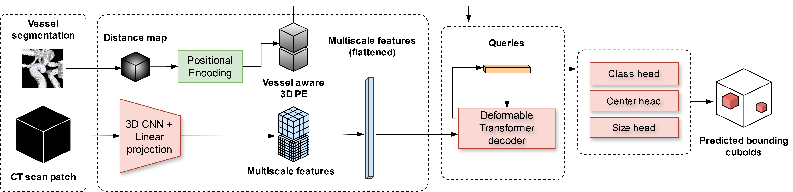

# Vessel-aware aneurysm detection using multi-scale deformable 3D attention




## Citing us

If you find our work useful, please consider citing our paper:

```
Alberto M. Ceballos-Arroyo, Hieu T. Nguyen, Fangrui Zhu, Shrikanth M. Yadav, Jisoo Kim, Lei Qin, Geoffrey Young, and Huaizu Jiang. 2024. Vessel-Aware Aneurysm Detection Using Multi-scale Deformable 3D Attention. In Medical Image Computing and Computer Assisted Intervention – MICCAI 2024: 27th International Conference, Marrakesh, Morocco, October 6–10, 2024, Proceedings, Part V. Springer-Verlag, Berlin, Heidelberg, 754–765. https://doi.org/10.1007/978-3-031-72086-4_71
```

An open access version of the paper and the supplementary materials (as well as the MICCAI '24 reviews, meta-reviews, and our rebuttal) is available here: https://papers.miccai.org/miccai-2024/831-Paper2366.html


## Accessing the segmentation Docker image


Vessel segmentation docker image can be downloaded from: https://drive.google.com/file/d/1qa91P423Sp5fMqUUoMxBGV0EUEAQirBC/view 

You then can run ```docker load -i vessel_seg_og.tar``` to make it available in your environment.


## Downloading weights for the detection model

Weights can be downloaded from the following link: https://drive.google.com/file/d/1-5gOZEcdJ14Ght1hSZGSKsAyPLFT-y8o/view?usp=sharing

After doing so, create the following chain of folders inside the repository:

`models/decoder_only_no_rec_pe_edt/`

And place the weights file inside.

## Environment setup (non-Docker)

Install CUDA toolkit 12.1.0 as follows or use an existing installation:

```bash
wget https://developer.download.nvidia.com/compute/cuda/12.1.0/local_installers/cuda_12.1.0_530.30.02_linux.run
sudo sh cuda_12.1.0_530.30.02_linux.run
```

Then install the following dependencies:

```bash
conda create --name=cta python=3.10
conda activate cta
pip install -r requirements_torch.txt
pip install -r requirements_base.txt
python -m pip install 'git+https://github.com/facebookresearch/detectron2.git'
pip install opencv-python==4.8.0.76
```
## Inference instructions

### File organization for inference

You should organize your input files as follows:

```bash
[ROOT_FOLDER]/
    og/
        scan_1.nii.gz
        ...
        scan_n.nii.gz
```

### Preprocessing files for inference

Now, change the path defined in line 9 of ```run_preproc_pipeline_inf.sh``` to your root folder and run it as follows:

```bash
./run_preproc_pipeline_inf.sh
```

### Running inference

After running the above, you can do inference using the following list of commands. Just make sure you replace [ROOT_FOLDER] with the actual path to your data.

Note: we define threshold to be the same as used in our paper but feel free to change it if you want slightly higher sensitivity at the cost of more false positives.
```bash

export path_base="[ROOT_FOLDER]"
export path_scans="${path_base}/crop_0.4"
export path_edt="${path_base}/crop_0.4_vessel_edt"
export path_outputs="${path_base}/predictions"
export model_name="decoder_only_no_rec_pe_edt"
export checkpoint_name="final"
export threshold=0.95

./run_inference.sh ${model_name} ${checkpoint_name} ${path_scans} ${path_edt} ${path_outputs} ${threshold}
```

Output files will be placed under the ```predictions``` folder. You will be able to find a .csv file with all predictions (including those under the confidence threshold) and a folder with nifti files with filtered predictions.


## Training instructions

WIP.

## Running the segmentation model standalone

The vessel segmentation model will segment all vessel-like structures in the brain and output  nifti files where 0 is background and 1 is a vessel (the model doesn't distinguish between veins or arteries).

If you want to run the segmentation model alone, you can use the command below after loading the docker image as specified above. Just make sure you replace [PATH_TO_DESIRED_OUTPUT_FOLDER] and [PATH_TO_INPUT_FOLDER] with the actual paths to your data. The input folder should contain the CTA scans in nifti format. After execution, the output folder will contain the segmentation masks under `[PATH_TO_DESIRED_OUTPUT_FOLDER]/Predictions`.

```bash
export path_outputs="[PATH_TO_DESIRED_OUTPUT_FOLDER]"
export path_inputs="[PATH_TO_INPUT_FOLDER]"

sudo docker run --gpus all -it --rm -v ${path_outputs}/:/Data/aneurysmDetection/output_path/  -v ${path_inputs}/:/Data/aneurysmDetection/input_cta/ --shm-size=24g --ulimit memlock=-1 vessel_seg:latest python /Work/scripts/extractVessels.py -d /Data/aneurysmDetection/input_cta/ /Data/aneurysmDetection/output_path -m 'Prediction' -t 16 -s 0.5 -g 1
```

Parameters: t defines the number of CPU threads to use, s is the sliding window coefficient and g is the number of GPUs. We haven't tested the docker image extensively with more than a single GPU, so please let us know if you encounter any issues. In any case, we recommend using a GPU with at least 11 GB of VRAM.
